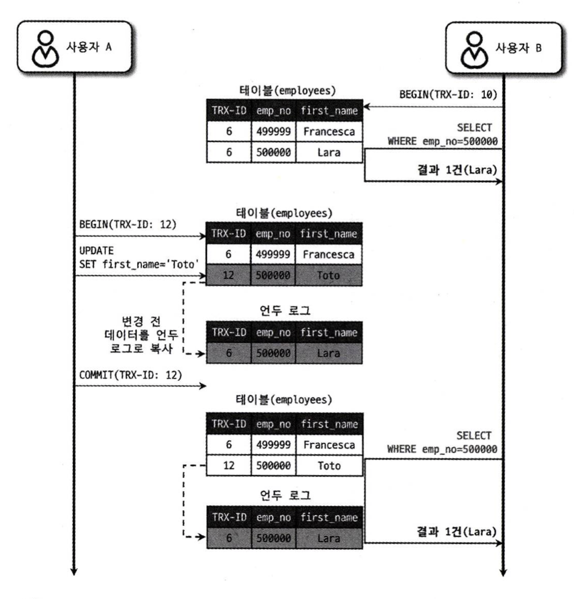
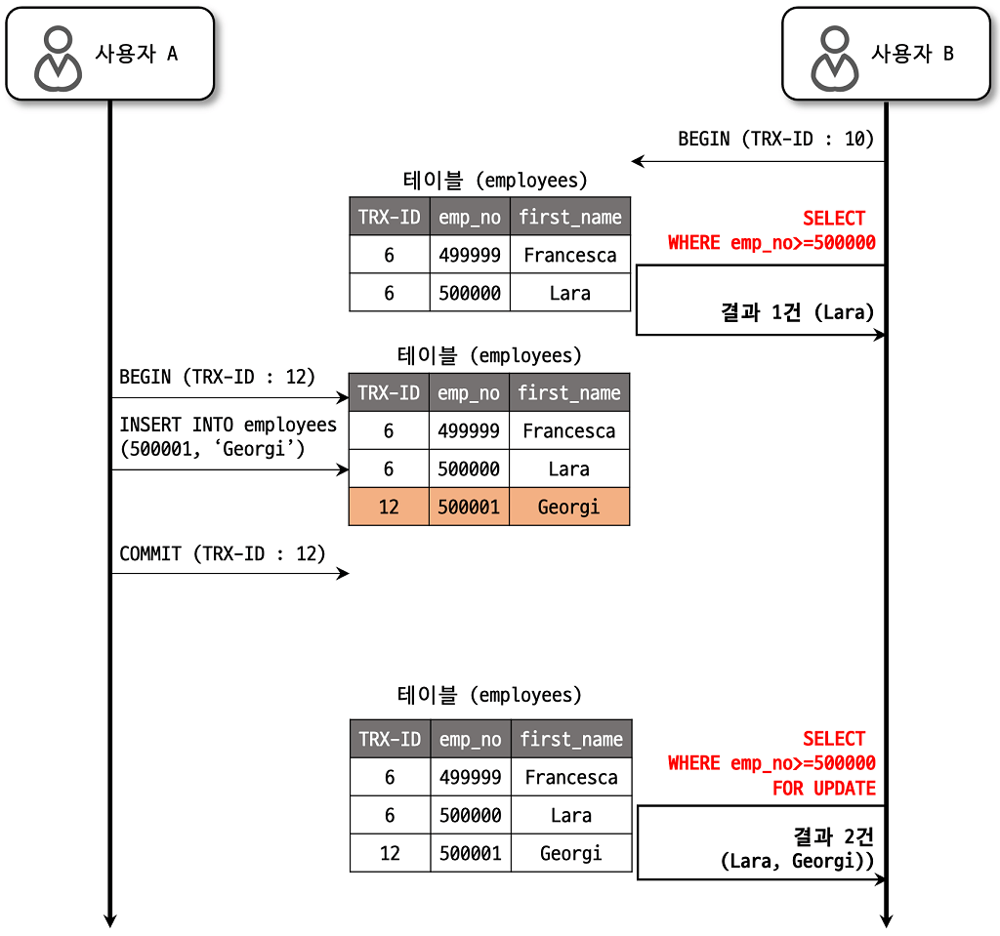

# 5.4 MySQL의 격리 수준
- 트랜잭션의 격리 수준(isolation level)이란 여러 트랜잭션이 동시에 처리될 때 특정 트랜잭션이 다른 트랜잭션에서 변경하거나 조회하는 데이터를 볼 수 있게 허용할지 말지를 결정하는 것이다.
- 격리수준은 크게 4가지로 나뉜다.
  - READ UNCOMMITED
  - READ COMMITED
  - REPEATABLE READ
  - SERIALIZABLE
- READ UNCOMMITED은 일반적으로 사용하지 않는다. 
- SERIALIZABLE은 동시성이 중요한 경우 사실상 사용하지 않는다.
- READ COMMITED와 REPEATABLE READ은 성능 상 차이가 거의 없다. 다만 오라클은 전자를 MySQL은 후자를 주로 사용 한다.

|격리 수준|DIRTY READ|NON-REPEATABLE READ| PHANTOM READ     |
|----------|-------------------|------------|------------------|
|READ UNCOMMITTED|발생|발생| 발생               |
|READ COMMITTED|없음|발생| 발생               |
|REPEATABLE READ|없음|없음| 발생 (InnoDB 는 없음) |
|SERIALIZABLE|없음|없음| 없음               |


## 5.4.1 READ UNCOMMITTED 
- 다른 트랜잭션의 커밋과 롤백의 여부와 관계 없이 변경된 데이터를 즉각 보여준다. 이처럼 다른 트랜잭션의 완료되지 않는 작업을 볼 수 있는 현상을 더티 리드(Dirty read)라 한다.
- 더티 리디의 문제로 RDBMS 표준에서는 이를 격리 수준으로조차 인정하지 않는다. 
 


## 5.4.2 READ COMMITED
- 오라클 및 많은 온라인 서비스에서 가장 많이 선택하는 격리 수준.
- 더티 리드가 발생하지 않는다. 
- 다만 NON-REPEATABLE-READ가 발생한다.  하나의 트랜잭션 내에서 똑같은 SELECT 쿼리를 실행했을 때는 항상 같은 결과를 가져와야 한다는 "REPEATABLE READ" 정합성에 어긋난다.
- 트랜잭션 내의 SELECT 쿼리의 일관성이 중요한 로직에서는 사용할 수 없다.


- NON-REPEATABLE-READ 실습. 격리수준 READ COMMITTED과 REPEATABLE READ을 비교한다.  

```sql
-- tx1 read committed
select * from t001 where id = 1;

-- tx2 update and commit
update t001 set name = 'changed' where id = 1;

-- tx1 read committed
select * from t001 where id = 1;
-- > changed
```

```sql
-- tx1 repeatable read
select * from t001 where id = 1;

-- tx2 update and commit
update t001 set name = 'changed' where id = 1;

-- tx1 read committed
select * from t001 where id = 1;
-- > kim
```

## 5.4.3 REPEATABLE READ
- MySQL InnoDB의 기본 격리 수준으로 REPEATABLE READ 정합성을 달성.
- 바이너리 로그를 가진 MySQL 서버에서 사용해야하는 최소한의 격리 수준.
- READ COMMITED은 가장 최근의 언두를 리턴하지만 REPEATABLE READ은 자신의 트랜잭션보다 낮은 트랜잭션이 처리한 언두의 값을 바라 본다.
- 다만 for udpate를 사용할 경우 팬텀 리드(Phantom Read)로 인한 부정합이 발생할 수 있다.   





- 팬텀리드 실습.

```sql
create table t001 (
  id int primary key,
  name varchar(1000)
);

insert into t001(id, name) values (1, 'kim'), (2, 'lee');
```

```sql
-- tx1
select * from t001 where id >= 2;
-- > lee

-- tx2, insert and submit
insert into t001(id, name) values (3, 'choi');

-- tx1
select * from t001 where id >= 2;
-- > lee
select * from t001 where id >= 2 for update;
-- > lee, choi
```

## 5.4.4 SERIALIZABLE
- InnoDB의 기본적인 원칙인 Non-locking consistent read(장금이 필요 없는 일관된 읽기)를 지키지 않는 격리 수준으로서, select 쿼리마다 공유 잠금(읽기 잠금)을 획득한다. 즉, SERIALIZABLE 트랜잭션이 읽은 레코드를 다른 트랜잭션은 수정할 수 없어서 팬텀 리드가 발생하지 않는다.
- 가장 엄격하되, 성능 상 손해가 발생.
- 다만, 갭 락과 넥스트 키 락 덕분에 REPEATABLE READ 에서도 팬텀 리드를 방지할 수 있으므로 반드시 쓸 필요는 없다.
