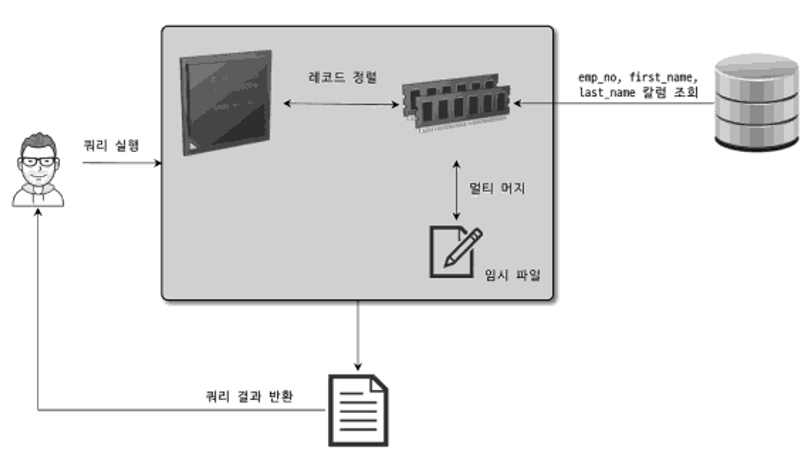
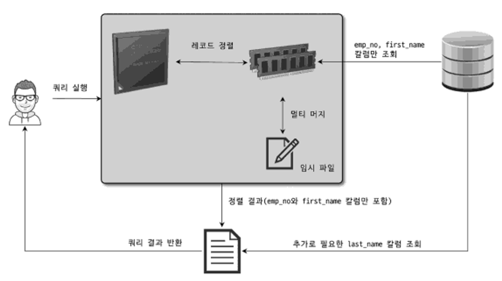
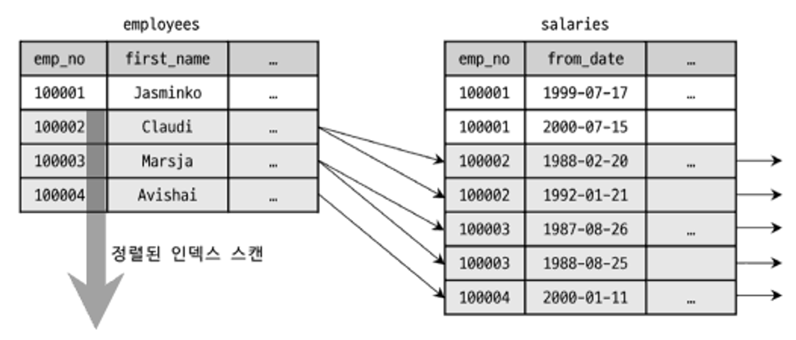
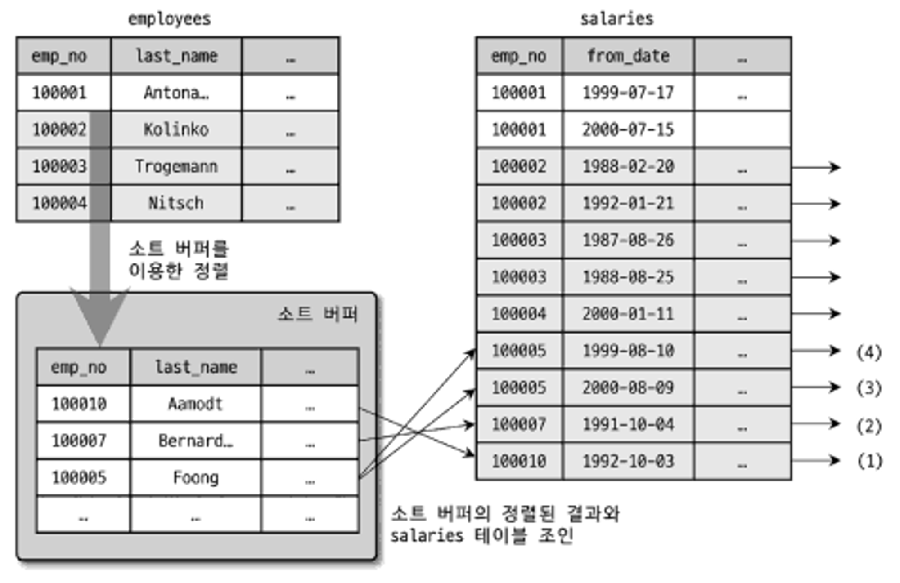
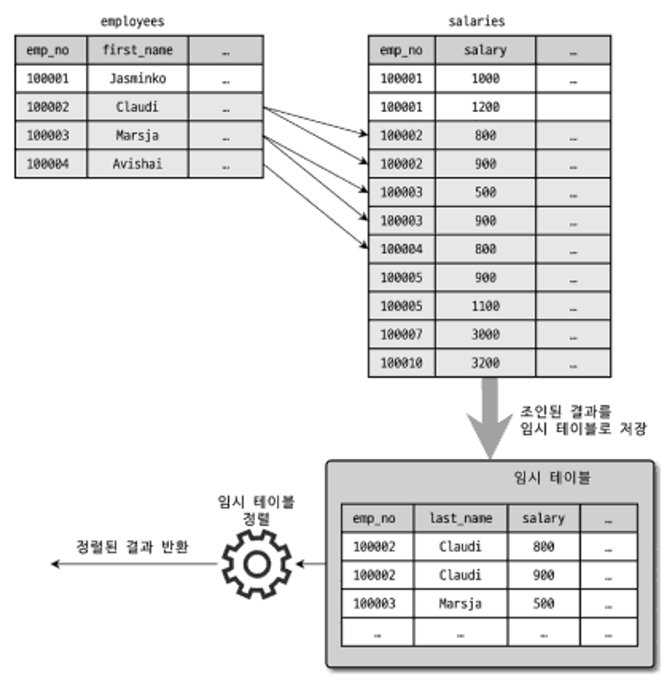

# 9.1 개요
- 옵티마이저: MySQL에서 쿼리를 최적으로 실행하기 위해 각 테이블의 데이터가 어떤 분포로 저장돼 있는지 통계 정보를 참조하며, 최적의 실행 계획을 수립하기 위한 기능.

## 9.1.1 쿼리 실행 절차
- SQL 파싱한다. SQL 파서로 SQL 문장을 쪼개서 MySQL 서버가 이해할 수 있는 수준으로 분리(SQL 파스 트리)
- 파스 트리로 테이블의 읽는 순서와 사용할 인덱스를 결정
  - 불필요한 조건 제거 및 복잡한 연산의 단순화
  - 여러 테이블의 조인이 있는 경우 어떤 순서로 테이블을 읽을지 결정
  - 각 테이블에 사용된 조건과 인덱스 통계 정보를 이용해 사용할 인덱스를 결정
  - 가져온 레코드들을 임시 테이블에 넣고 다시 한번 가공해야 하는지 결정
- 결정한 내용에 따라 스토리지 엔진으로부터 데이터를 추출

## 9.1.2 옵티마니저의 종류
- 비용 기반 최적화(Cost-based optimizer)
  - 대상 테이블의 정보를 기반으로 실행 계획별 비용을 산출하여 최적의 방법을 선택. 
  - MySQL을 포함한 현재의 대부분의 RDBMS가 채택하는 방법. 
- 규칙 기반 최적화(Rule-based optimizer)
  - 옵티마이저 내부의 우선 순위에 따라 동작. 
  - 비용 계산이 부담스러웠던 예전에 사용하던 방법.

# 9.2 기본 데이터 처리
## 9.2.1 풀 테이블 스캔과 풀 인덱스 스캔
- 옵티마이저가 풀 테이블 스캔을 선택할 때
  - 테이블의 레코드 건수가 너무 작아 인덱스를 사용하는 것보다 빠른 경우 (일반적으로 테이블이 페이지 1개로 구성된 경우)
  - WHERE 절이나 ON 절에서 인덱스를 이용할 수 있는 적절한 조건이 없는 경우
  - 인덱스 레인지 스캔을 사용할 수 있는 쿼리라고 하더라도 옵티마이저가 판단한 조건 일치 레코드 건수가 너무 많은 경우(인덱스의 B-Tree를 샘플링해서 조사한 통계 정보 기준)
- 풀 스캔과 리드 어헤드(read ahead)
  - 풀 스캔을 할 경우 포그라운드 스레드뿐만 아니라 백그라운드 스레드가 돕는다. 처음에는 포그라운드 스레드로 풀 스캔을 수행하나, 특정 읽기 시점부터 백그라운드 스레드와 함께 풀스캔을 수행한다. 백그라운드 스레드는 포그라운드 스레드가 사용할 레코드를 버퍼 풀에 미리 가져다 두며 풀스캔에 대한 성능 최적화를 달성한다. 이를 리드 어헤드라 한다.
  - innodb_read_ahead_threshold를 통해 백그라운드 스레드를 사용하기 위한 임계점을 설정할 수 있다. 디폴트 값으로 충분하나, 데이터 웨어하우스용으로 서버를 사용할 경우 그 임계 값을 낮은 값으로 설정하여 더 빨리 리드 어헤드의 시작을 유도할 수 있다.
- 풀 인덱스 스캔과 리드 어헤드
  - `select count(1) from table`의 경우 단순한 갯수만을 필요하므로 인덱스 풀 스캔을 할 사용할 가능성이 높다.

## 9.2.2 병렬처리
- 하나의 쿼리를 여러 스레드가 나누어 동시에 처리하는 기능으로 MySQL 8.0 이후 사용 가능.
- innodb_parallel_read_threads로 설정.
- 현재는 `select * from table` 과 같이 어떤 조건이 없는 경우에서만 사용 가능하다.

## 9.2.3 ORDER BY 처리(Using filesort)
- 정렬 처리의 방법
  - 인덱스의 사용
    - 이미 정렬된 인덱스를 사용. 매우 빠름
    - INSERT, UPDATE, DELETE를 수행할 때 인덱스 추가/삭제 작업으로 인한 성능 손실. 별도의 디스크/버퍼풀 공간 필요.
  - Filesort 이용
    - 인덱스를 사용하지 않음. 
    - 인덱스의 사용 비용이 존재하지 않음.
    - 정렬할 레코드가 많지 않으면 충분히 빠르지만, 정렬할 레코드가 많을 수록 느려짐
- 다만, 모든 상황에서 인덱스를 사용할 수 없음. 
  - 정렬 기준이 너무 많음.
  - GROUP BY나 DISTINCT의 결과를 정렬
  - UNION이나 임시 테이블을 정렬
  - 랜덤하게 레코드를 가져와야 할 때
- 실행 계획에서 Extra 칼럼에 "Using filesort" 여부를 통해 사용 여부 확인 가능.

### 9.2.3.1 소트 버퍼
- 소트 버퍼란 정렬을 수행하기 위한 별도의 메모리 공간.
- 소트 버퍼의 크기는 정렬할 때마다 가변적. 해당 버퍼는 쿼리 실행 완료 후 바로 반납.
- 최대치를 sort_buffer_size로 설정 가능. 설정한 소트 버퍼의 크기보다 더 많은 메모리가 정렬에 필요할 경우 디스크를 사용. 소트 버퍼에서는 정렬을 수행하고 그 결과를 디스크에 반영하며 정렬이 필요한 데이터를 다시 소트 버퍼에 가져오는 것을 반복. 이런 병합 작업을 멀티 머지라 하며 그 횟수는 Sort_merge_passes라는 상태 변수에 집계됨.
- 다만, 버퍼의 크기에 따른 정렬 성능은 완전하게 비례하지 않으며 책에서는 56KB - 1MB 사이를 추천.
- 오히려, 너무 큰 소트 버퍼는 OOM을 발생시킴. 각 세션 마다의 소트 버퍼가 할당되므로 버퍼의 크기를 너무 크게 설정할 경우 OOM이 발생할 수 있음. 만약 소트 버퍼를 크게 설정해야 할 경우, 특정 세션에 대해서만 일시적으로 늘리는 방법을 선택해야 한다.

### 9.2.3.2 정렬 알고리즘
- 싱글 패스: 소트 버퍼에 필요로 한 모든 레코드를 한 번에 가지고 와서 처리한다. 레코드의 갯수가 적거나 칼럼이 적을 수록 유리함. 
- 투 패스: 소트 버퍼에 PK와 정렬 및 검색 조건에 포함되는 칼럼만 가져온다. 쿼리 결과를 반환할 때 다시 한 번 DB에 호출하며 나머지 칼럼을 채운다.
- 최신 버전의 MySQL은 싱글 패스 정렬을 우선하되 아래 상황에서는 투 패스를 사용한다.
  - 레코드의 크기가 max_length_for_sort_data 시스템 변수에 설정된 값보다 클 때
  - BLOB이나 TEXT 타입 칼럼이 SELECT 대상에 포함될 때




### 9.2.3.3 정렬 처리 방법
- ORDER BY를 사용하는 경우 아래 세 개의 처리 방법 중 하나를 사용 한다.
  - 인덱스를 사용한 정렬
  - 조인에서 드라이빙 테이블만 정렬
  - 조인에서 조인 결과를 임시 테이블로 저장 후 정렬

#### 9.2.3.3.1 인덱스를 사용한 정렬
- order by에 명시된 칼럼이 제일 먼저 읽는 테이블에 속하고, order by의 순서대로 생성된 인덱스가 있어야 한다. 
- nested loop join을 사용하므로 드라이빙 테이블의 인덱스에 맞춰 정렬한다.



#### 9.2.3.3.2 조인에서 드라이빙 테이블만 정렬
- 드라이빙 테이블의 칼럼만 order by의 조건으로 있어야 한다. 먼저 드라이빙 테이블 기준으로 레코드를 소트 버퍼에 보관 후, 소트 버퍼를 드라이빙 테이블의 칼럼으로 정렬한다. 그리고 드리븐 테이블을 드라이븐 테이블에 조인한다. 



#### 9.2.3.3.3 조인에서 조인 결과를 임시 테이블로 저장 후 정렬
- 위 두 개의 조건을 달성하지 못할 경우 발생한다. 가장 느리다.
- 조인 결과를 임시 테이블에 저장한 후 정렬한다. 
- 실행 계획에서 "Using temporary; Using filesort"란 코멘트가 표시된다.



#### 9.2.3.3.4 정렬 처리 방법의 성능 비교
##### 9.2.3.3.4.1 스트리밍 방식
- 서버 쪽에서 처리할 데이터가 얼마인지에 관계 없이 조건에 일치하는 레코드가 검색될 때마다 바로바로 클라이언트에 전송한다. 
- 인덱스를 통한 정렬 방식인 경우 추가적인 정렬이 필요 없으므로 처리하는 순서대로 바로 데이터를 보내도 문제가 없다.
- 스트리밍 방식의 경우 인덱스를 통한 정렬 방식에서만 동작한다. 인덱스를 기준으로 추출한 데이터를 클라이언트에 지속적으로 보낼 수 있다. 그러므로 LIMIT을 설정할 경우 서버의 처리 성능 상 이점이 있다.

##### 9.2.3.3.4.2 버퍼링 방식
- 서버에서 group by, order by, where 등으로 전체 데이터를 수집한 후 처리하는 방식.
- 클라이언트는 서버의 결과를 모와 일괄 가공할 때까지 기다려야 한다.    
- 반면, 버퍼링 방식은 filesort에서 데이터를 다 처리한 후 클라이언트에 데이터를 보낸다. 이미 처리한 데이터에서 LIMIT을 사용하므로 성능 상 이점이 크지 않다.

##### JDBC와 스트리밍 
- JBCD의 경우 스트리밍으로 데이타가 처리된다 하더라도 버퍼링 방식을 채택한다. 스트리밍으로 자바 로직에서 처리하는 것보다, 전체 데이터를 한 번에 처리하는 것이 효과적이라 판단하기 때문이다.

## 9.2.4 GROUP BY 처리
- group by는 order by와 마찬가지로 스트리밍 처리가 불가능.
- group by는 having 절과 함께 사용하는데, group by 결과에 대한 필터링 역할을 수행하므로 인덱스 처리를 할 수 없다.
- group by는 인덱스를 사용할 수 있다. 
  - 인덱스를 차례 대로 읽는 인덱스 스캔
  - 인덱스를 건너뛰면서 읽는 루스 인덱스 스캔
  - (인덱스를 사용하지 못할 경우) 임시 테이블

### 9.2.4.1 인덱스 스캔을 이용하는 GROUP BY(타이트 인덱스 스캔)
- 조인의 드라이빙 테이블에 속한 칼럼만 이용해 그루핑을 하며, 해당 칼럼이 이미 인덱스가 있을 경우, 인덱스를 사용하며 그루핑 작업 및 조인을 수행한다. 

### 9.2.4.2 루스 인덱스 스캔을 이용하는 GROUP BY
- 인덱스의 레코드를 건너뛰면서 필요한 부분만 읽어서 가져오는 방식
- 실행 계획(extra)에서 "Using index for group-by"로 표시된다.
- 해당 쿼리의 실행 순서
  - `EXPLAIN SELECT emp_no FROM salaries WHERE from_date=1958-03-01' GROUP BY emp_no;`
  - (emp_no, from_date) 인덱스를 차례대로 스캔하면서 emp_no의 첫 번째 유일한 값(그룹 키) "10001"을 찾아낸다.
  - (emp_no, from_date) 인덱스에서 emp_no가 '10001'인 것 중에서 from_date 값이 '1985-03-01'인 레코드만 가져온다. 이 검색 방법은 1번 단계에서 알아낸 '10001' 값과 쿼리의 WHERE 절에 사용된 "from_date='1985-03- 01'" 조건을 합쳐서 "emp_no=10001 AND from_date='1985-03-01'" 조건으로 (emp_ no, from_date) 인덱스 를 검색하는 것과 거의 흡사하다.
  - (emp_no, from_date) 인덱스에서 emp_no의 그다음 유니크한(그룹 키) 값을 가져온다.
  - 3번 단계에서 결과가 더 없으면 처리를 종료하고, 결과가 있다면 2번 과정으로 돌아가서 반복 수행한다.

### 9.2.4.3 임시 테이블을 사용하는 GROUP BY
- 인덱스를 전혀 사용하지 못하는 경우 임시 테이블을 사용한다.
- 실행 계획(extra)에서 "Using temporary"로 표시된다. 
- MySQL 8.0 이전에는 정렬(Using filesort)이 묵시적으로 수행되었으나, 이후에는 수행되지 않는다.

```sql
SELECT e.last_name, ABG(s.salary) FROM employees e, salaries s WHERE s.emp_no=emp_no GROUP BY e.last_name;
```

- group by를 임시 테이블에 사용하는 방식은 다음과 같다.
  - group by 절의 칼럼들로 구성된 유니크 인덱스를 가진 임시 테이블을 만든다. (e.last_name이 유니크가 된다)
  - 조인의 결과를 한 건씩 가져와 임시 테이블에 중복 체크를 하면서 INSERT 혹은 UPDATE를 실행한다.

### 9.2.5 DISTINCT 처리
-  DISTINCT의 경우 집합 함수를 사용하는 경우와 그렇지 않은 경우를 구분해야 한다.

#### 9.2.5.1 SELECT DISTINCT ...
- 단순하게 SELECT되는 레코드 중 유니크한 레코드를 가져오는 경우 SELECT DISTINCT를 사용한다. 이 경우 group by와 동일하게 동작한다. 특히 MySQL 8.0 이후 GROUP BY는 묵시적으로 ORDER BY를 사용하지 않으므로 내부적으로 같다.
- 다만, DISTINCT를 사용할 때 실수하는 것이 있는데, 특정 칼럼만 유니크하게 조회하는 것이 아닌 모든 조합 전체의 유니크한 레코드를 가져온다. 
- `SELECT DISTINCT emp_no, last_name FROM employees;`

#### 9.2.5.2 집합 함수와 함께 사용된 DISTINCT
- COUNT() 또는 MIN(), MAX() 같은 집합 함수 내에 DISTINCT 키워드를 사용할 수 있다. 이 경우 함수에 삽입되는 인자 중 유니크한 값만을 사용한다.
- 이 경우 실행 계획에서 "Using temporary"를 표시하지 않는다.
- 아래 테이블은 두 개의 COUNT 함수에 대하여 각 각 임시 테이블을 생성한다.  

```sql
SELECT COUNT(DISTINCT s.salary), COUNT(DISTINCT e.last_name)
       FROM employees e, salaries s
       WHERE e.emp_no=s.emp_no
       AND e.emp_no BETWEEN 100001 AND 100100;
```

- 다만 아래와 같이 인덱스가 존재하는 칼럼에 대해서는 임시 테이블 없이 최적화 한다.

```sql
SELECT COUNT(DISTINCT emp_no) FROM dept_emp GROUP BY dept_no;
```

### 9.2.6 내부 임시 테이블 활용
- MySQL 엔진이 스토리지 엔진으로부터 받아온 레코드를 정렬하거나 그루핑할 때는 내부적인 임시 테이블을 사용한다. 일반 임시 테이블과 달리 내부적 임시 테이블은 다른 세션이나 다른 쿼리에서는 볼 수 없고 사용할 수 없다. 쿼리 처리가 완료되면 자동으로 삭제된다.

#### 9.2.6.1. 메모리 임시 테이블과 디스크 임시 테이블
- MySQL 8.0 이전에는 메모리에서는 MEMORY 스토리지 엔진을 사용하며 디스크에 저장될 때는 MyISAM 스토리지 엔진을 사용한다.
- MySQL 8.0 이후에는 메모리에서는 TempTable을 사용하며 디스크에서는 InnoDB를 사용한다.
- 기존 MEMORY 엔진의 경우 VARCHAR 등 가변 길이 타입을 지원하지 못하므로 메모리 낭비가 발생하였다. 디스크에서는 MyISAM이 트랜잭션을 지원하지 못하는 문제가 존재하였다. 8.0 이후에는 가변 길이 타입와 트랜잭션을 지원하게 된다.
- internal_tmp_mem_storage_engine : 8.0 이후 변수. 메모리용 임시 테이블의 설정. TempTable 이나 MEMORY 중 선택
- temptable_max_ram : TempTable의 최대 사용량. 기본 1GB. 
- temptable_use_mmap: temptable_max_ram을 초과할 경우 디스크로 저장한다. InnoDB 혹은 MMAP 중 선택 가능하다. InnoDB의 오버헤드로 인하여 주로 MMAP을 사용한다.

#### 9.2.6.2 임시 테이블이 필요한 쿼리
- 아래는 대표적으로 내부 임시 테이블을 생성하는 케이스이다. 이밖에 인덱스를 사용할 수 없는 경우 임시 테이블을 생성한다. 
  - ORDER BY나 GROUP BY에 명시된 칼럼이 다른 쿼리
  - ORDER BY나 GROUP BY에 명시된 칼럼이 조인의 순서상 첫 번째 테이블이 아닌 쿼리
  - DISTINCT와 ORDER BY가 동시에 쿼리에 존재하는 경우 또는 DISTINCT가 인덱스로 처리되지 못하는 쿼리
  - UNION이나 UNION DISTINCT가 사용된 쿼리(select_type 칼럼이 UNION RESULT인 경우)
  - 쿼리의 실행 계획에서 select_type이 DERIVED인 쿼리
- 쿼리에 따라 임시테이블을 사용한다는 의미에서 extra 칼럼에 "Using temporary"를 표시한다. 하지만 마지막 3개의 패턴은 표시하지 않는다.
- 첫 번째부터 네 번째까지의 쿼리 패턴은 유니크 인덱스를 가지는 내부 임시 테이블이 만들어진다. 처리 성능이 느리다.
- MySQL 8.0 이후 UNION ALL의 경우 임시 테이블을 사용하지 않도록 개선하였으나 UNION과 UNION DISTINCT는 여전히 임시테이블 사용.

#### 9.2.6.4 임시 테이블 관련 상태 변수
- 실행 계획상에서 "Using tempoaray"를 통해 임시 테이블 사용 여부를 확인할 수 있음.
- SHOW SESSION STATUS LIKE 'Created_tem%';를 사용할 경우 임시 테이블의 생성 횟수를 확인 가능.

## 기타 참고
- 중첩 루프: https://seokrae.gitbook.io/sr/database/database/2021-07-17-db-toc/2021-08-07-db-join

- DERIVED
> DERIVED는 FROM 절에 사용된 서브 쿼리로부터 발생한 임시 테이블을 의미합니다. 임시 테이블은 메모리에 저장될 수도 있고 디스크에 저장될 수도 있습니다. 일반적으로 메모리에 저장하는 경우에는 크게 성능에 영향을 미치지 않지만, 데이터의 크기가 커서 임시 테이블을 디스크에 저장하면 성능이 떨어집니다. https://12bme.tistory.com/168