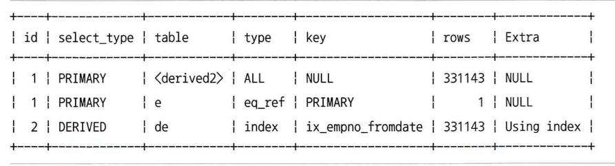
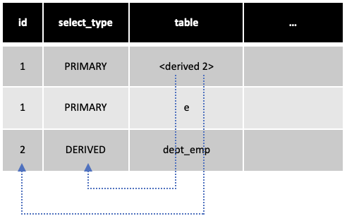
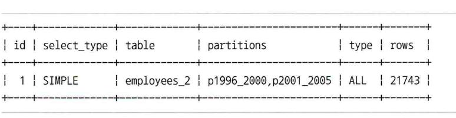
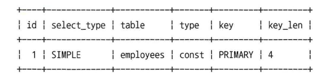
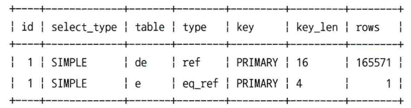

# 10.3 실행 계획 분석
## 10.3.3 table 칼럼
- MySQL 서버의 실행 계획은 단위 SELECT 쿼리 기준이 아니라 테이블 기준으로 표시됨.
- 테이블의 이름에 별칭이 부여된 경우에는 별칭을 표시.

```sql
EXPLAIN 
SELECT *
FROM (SELECT de.emp_no FROM dept_emp de GROUP BY de.emp_no ) tb, employees e
WHERE e.emp_no=tb.emp_no;
```




- 첫 번째 라인의 table 칼럼의 값이 `<derived2>`
- 이는 단위 SELECT 쿼리의 id 값이 2인 실행 계획으로부터 만들어진 파생 테이블을 가리팀

- select_type이 MATERIALIZED인 경우 `<subquery N>` 의 형태로 표시.

## 10.3.4 partitions 칼럼
- MySQL 5.7 버전까지는 옵티마이저가 사용하는 파티션들의 목록은 EXPLAIN PARTITION 명령을 이용해 확인 가능했지만, 8.0 버전부터는 EXPLAIN 명령으로 파티션 관련 실행 계획까지 모두 확인할 수 있게 변경됨.

```sql
CREATE TABLE employees_2 (
	emp_no int NOT NULL,
    birth_date DATE NOT NULL,
    first_name VARCHAR(14) NOT NULL,
    last_name VARCHAR(16) NOT NULL,
    gender ENUM('M', 'F') NOT NULL,
    hire_date DATE NOT NULL,
    PRIMARY KEY (emp_no, hire_date)
) PARTITION BY RANGE COLUMNS(hire_date)
(PARTITION p1986_1990 VALUES LESS THAN ('1990-01-01'),
 PARTITION p1991_1995 VALUES LESS THAN ('1996-01-01'),
 PARTITION p1996_2000 VALUES LESS THAN ('2000-01-01'),
 PARTITION p2001_2005 VALUES LESS THAN ('2006-01-01'));
 
INSERT INTO employees_2 SELECT * FROM employees;
```

- 파티션 프루닝 ( Partition pruning): 파티션이 여러 개인 테이블에서 불필요한 파티션올 빼고 쿼리를 수행하기 위해 접근해야 할 것으로 판단되는 데이블만 골라내는 과정

```sql
EXPLAIN
SELECT *
FROM employees_2
WHERE hire_date BETWEEN '1999-11-15' AND '2000-01-15';
```



- 위 실행 계획의 type 칼럼의 값은 ALL인 이유는, MySQL을 포함한 대부분의 RDBMS에서 지원하는 파티션은 물리적으로 개별테이블처럼 별도의 저장 공간을 점유. 결국 p1996_2000와 p2001_2005 파티션을 풀 스캔 한다는 의미.

## 10.3.5 type 칼럼
- type 이후의 칼럼은 MySQL 서버가 각 테이블의 레코드를 어떤 방식으로 읽는지 표현. 성능에 있어서 매우 중요한 요소.
- type 칼럼을 MySQL 매뉴얼에서는 조인 타입으로 소개한다. 다만, 각 테이블의 접근 방식(Access type)으로 해석하는 것이 편하다.
- ALL을 제외한 모든 방법은 인덱스를 사용한다. index_merge를 제외한 모든 방식은 단 하나의 인덱스만 사용한다.

- type 칼럼의 값을 속도에 따라 나열하면 다음과 같다. 옵티마이저는 다음의 순서를 기반으로 최소의 비용을 계산한다.
  - system
  - const
  - eq_ref
  - ref
  - fulltext
  - ref_or_null
  - unique_subquery
  - index_subquery
  - range
  - index_merge
  - index
  - ALL

### 10.3.5.1 system
- 레코드가 1건만 존재하는 테이블 또는 한 건도 존재하지 않는 테이블을 참조.
- InnoDB 스토리지 엔진의 경우 존재하지 않는다. MyISAM 혹은 MEMORY에만 존재함.

### 10.3.5.2 const
- 발생 조건
  - 프라이머리키나 유니크키 칼럼을 이용하며
  - WHERE 조건절을 가지고 있으며
  - 반드시 1건을 반환하는 쿼리
- 프라이머리키라 하더라도 다중 칼럼일 경우 단 하나만 일치하면 ref로 표시된다. 왜냐하면 유일한 레코드임을 보장하지 못하기 때문이다.
- const란 이름에서 나타나는 것처럼 실제로 상수처럼 최적화된다.
- 유니크 인덱스 스캔 (UNIQUE INDEX SCAN) 이라고도 표현한다.

- `EXPLAIN SELECT * FROM employees WHERE emp_no=10001;`




### 10.3.5.3 eq_ref
- 조인을 할 때 두 번째 테이블의 검색 조건이 프라이머리 키나 유니크 키일 경우 eq_ref 라고 한다. 더불어 const처럼 유일함을 보장해야 하며, NOT NULL이어야 한다.

```sql
SELECT de.dept_no, e.emp_no, e.first_name
FROM dept_emp de, employees e
WHERE e.emp_no=de.emp_no
  AND de.dept_no='d005';
```



### 10.3.5.4 ref
- 인덱스의 종류와 관계없이 동등 (Equal) 조건으로 검색할 때는 ref 접근 방법을 사용.
- 반환되는 레코드가 반드시 1건임을 보장하지 않음.


- dept_emp의 프라이머리 키는 (dept_no, emp_no) 로 구성. 결과적으로 dept_no의 일치여부는 유일함을 보장하지 않으므로 ref로 접근.

### 10.3.5.5 fulltext
- MySQL 서버의 전문 검색 (Full-text Search) 인덱스를 사용해 레코드를 읽는 접근 방법.

```sql
EXPLAIN
SELECT *
FROM employee_nam e
WHERE emp_no=10001 -- 1순위 const
    AND MATCH(first_name, last_name) AGAINST('Facello' IN BOOLEAN MODE); -- 2순위 fulltext
    AND emp_no BETWEEN 10001 AND 10005 -- 3순위 range
```

### 10.3.5.6 ref_or_null
- ref에 null이 추가된 형태.

```sql
EXPLAIN
SELECT * FROM titles
WHERE to_date ='1985-03-01' OR to_date IS NULL;
```

### 10.3.5.7 unique_subquery
- where 조건절에서 사용될 수 있는 IN(subquery) 형태의 쿼리를 위한 접근 방법.
- 서브쿼리에서 중복되지 않은 유니크한 값을 반한할 때 사용.
- 8.0 이후부터 조건에 따라 세미 조인으로 최적화가 될 수 있다.

```sql
explain
select * 
from departments
where dept_no IN (select dept_no from dept_emp where emp_no=10001);
```

### 10.3.5.8 index_subquery
- unique_subquery의 경우 중복이 발생하지 않는 것과 달리 index_subquery는 중복이 발생할 수 있을 때 사용.
- 인덱스를 사용하여 중복된 값을 제거.

### 10.3.5.9 range
- 인데스 레인지 스캔 접근 방법.
- <, >, is null, between, in like 등의 연산자를 사용하여 인덱스를 검색.
- 순위는 낮지만 range 수준까지는 최적의 성능을 보장
- 보통 인덱스 레인지 스캔을 말할 경우 const, ref, range를 포함.

### 10.3.5.10 index_merge
- 2개 이상의 인덱스를 이용해 각각의 검색 결과를 만든 후, 그 결과를 병합하는 방식.
  - 여러 인덱스를 읽어야 하므로 range보다 성능이 떨어짐.
  - 여러 인덱스 검색 결과의 부가적인 작업 필요: 교집합, 합집합, 중복제거 등

```sql
explain
select * from employees
where emp_no between 10001 and 11000
      or first_name='Smith';
```

### 10.3.5.11 index
- 인덱스를 처음부터 끝까지 읽는 인덱스 풀 스탠 방식.
- 풀 테이블 스캔의 검색 레코드 건수는 동일하나, 파일크기가 작으므로 테이블 풀 스캔보다 성능이 좋다.
- 인덱스에 포함된 칼럼만 필요하거나 그룹핑 및 정렬 가능할 경우, 테이블 풀 스캔이 아닌 인덱스 풀 스캔을 선택한다.

```sql
explain
select * from employees order by first_name
        desc limit 10;
```

- 위 쿼리는 dept_name 인덱스가 존재하며, 해당 인덱스로 정렬을 수행한다.
- limit 10을 활용해 인덱스 역순으로 작은 수의 데이터를 검색하기 때문에 매우 효율적인 쿼리다. 만약 limit이 없을 경우 상당히 느릴 수도 있다.

### 10.3.5.12 ALL
- 풀 테이블 스캔 방식. 가장 마지막에 선택하는 비효율적인 방식.
- 리더 어헤드 기능을 통해 병렬 처리로 많은 페이지를 읽어 들일 수 있음.
- 풀 테이블 스캔을 피하려고 잘못 튜닝하는 것보다 ALL이 나은 경우도 있음.

## 10.3.6 pssible_keys 칼럼
- 옵티마이저가 최적의 실행 계획을 만들기 위해 후보로 선정했던 접근 방법에서 사용된 인덱스 목록.
- 즉, 실제 실행 계획에서 사용되지 않음.

## 10.3.7 key 칼럼
- 최종 선택된 실행 계획에서 사용하는 인덱스.
- key 칼럼의 값
  - PRIMARY: 프라이머리 키
  - 그 외: 인덱스의 고유 이름
- 인덱스는 하나만 사용하므로 index_merge를 제외하고는 하나만 존재한다.

## 10.3.8 key_len 칼럼
- 쿼리를 처리하기 위해 인덱스에서 몇 개의 칼럼까지 사용했는지를 나타냄.
- 바이트 형태로 나타남.

```sql
explain 
select * from dept_emp where dept_no='d005';
```

- 위는 (dept_no, emp_no)를 프라이머리 키로 가진다.
- dept_no는 varchar(4)로서 16바이트이다.
- key_len은 실제로 16바이트를 사용함을 확인할 수 있다. varchar는 가변적이지만 MySQL은 고정적으로 4바이트를 사용한다.

```sql
explain 
select * from dept_emp where dept_no='d005' and emp_no=10001;
```

- key_len이 4바이트 추가된 20임을 확인할 수 있다. 왜냐하면 emp_no는 integer로서 4바이트 이기 때문이다.

- 데이터 타입에 따라 더 많은 바이트를 소모하기도 한다. 예를 들면 Date 타입은 Nullable을 정의하기 위하여 3바이트에서 1바이트를 추가한 총 4바이트를 key_len으로 사용한다.

## 10.3.9 ref 칼럼
- 접근 방법이 ref일 경우, 참조 조건으로 어떤 값이 제공됐는지 보여줌.
- 상수값을 제공하였으면 const, 다른 테이블의 칼럼값이면 그 테이블면과 칼럼명이 표시된다.
- 참조한 값이 함수로 인해 변환이나 연산되었을 경우 func(Function)이 표시된다.

```sql
explain
select *
from employees e, dept_emp de 
where e.emp_no = de.emp_no; -- ref : employee.e.emp_no
```

## 10.3.10 rows 칼럼
- 실행 계획의 효율성 판단을 위해 예측했던 레코드의 건수를 표시. 실제 레코드 갯수와 불일치 할 수 있음.
- row의 갯수에 따라 옵티마이저는 풀스캔 혹은 range 등 다양한 접근 방식을 선택할 수 있다.
- 좀 더 정확한 row를 가지려면 히스토그램을 사용할 수 있음.

```sql
explain 
select * from dept_emp 
-- where from_date >= '1985-01-01'; -- 3xxxx, all
-- where from_date >= '2002-01-01'; -- 2xx, range
```

## 10.3.11 filtered 칼럼
- row 칼럼은 인덱스를 사용하는 조건에만 일치하는 레코드의 건수. 인덱스 이외의 조건은 filtered 칼럼에 표시.

```sql
EXPLAIN
SELECT /*+ JOIN_ORDER(s,e) */ *
FROM employees e,
     salaries s
WHERE e.first_name = 'Matt'
  AND e.hire_date BETWEEN '1990-01-01' AND '1991-01-01'
  AND s.emp_no = e.emp_no
  AND s.from_date BETWEEN '1990-01-01' AND '1991-01-01'
  AND s.salary BETWEEN 50000 AND 60000;

/*
드라이빙 테이블 employees
id | select_type | table | type | key | rows. | filtered
1 | SIMPLE | e | ref | ix_firstname | 233 | 16.03
233건중에 16.03%만 인덱스를 사용하지 않은 e.hire_date BETWEEN ‘1990-01-01’ AND ‘1991-01-01’ 조건에 일치함
그러므로 수행한 레코드건수는 대략 37(233 * 0.1603)건이 된다.
*/

/*
드라이빙 테이블 salaries
id | select_type | table | type  | key       | rows | filtered
1  | SIMPLE      | s     | range | ix_salary | 3314 | 11.11
수행한 레코드 건수가 대략 368건(3314 * 0.1111)이 조건이 일치해서 employees 테이블로 조인 수행했을 것임
조인 횟수를 줄이고 메모리 사용량을 낮추기 위해 대상 건수가 적은 테이블(employees)을 선행 테이블로 선택할 가능성이 높다
*/
```

- filtered의 수치를 정확하게 하기 위하여 인덱스를 사용하지 않는 칼럼은 히스토그램으로 사용 가능.

## 10.3.12 Extra 칼럼
- 실행 계획 성능에 중요한 내용이 표시됨.
- MySQL의 버전이 올라가며 새로운 기능이 도입되며 계속 추가됨.


### 10.3.12.1 const row not found
- const 접근 방법으로 테이블을 읽었으나 실제로 해당 테이블에 레코드가 1건도 존재하지 않는 경우.

### 10.3.12.2 Deleting all rows
- 모든 레코드를 삭제할 경우 발생. where 절이 없는 delete 문장을 실행할 때 표시되며, 전체 삭제를 위한 최적화 API를 통해 처리됨을 의미.
- MySQL 8.0 이후부터는 전체 삭제를 할 때 truncate를 권장.

### 10.3.12.3 Distinct
- distinct를 사용할 경우 발생.
 
```sql
EXPLAIN
SELECT DISTINCT d.dept_no
FROM departments d, dept_emp de WHERE de.dept_no=d.dept_no;
```

### 10.3.12.4 FirstMatch
- 세미 조인의 최적화 중 FirstMatch 전략을 사용.

```sql
EXPLAIN
SELECT *
FROM employees e
        WHERE e.first_name='Kim'
          AND e.emp_no IN (
            SELECT t.emp_no FROM titles t
            WHERE t.from_date BETWEEN ' 1995-01-01' AND '1995-01-30'
        );
```

### 10.3.12.5 Full scan on NULL key
- `col1 in (select col2 from ...)` 의 형태의 쿼리에서, col1이 null일 경우 발생.
- col1이 NULL이면 서브쿼리에 사용된 테이블에 대해서 풀 테이블 스캔 ( Full scan )을 해야 하며, 이를 경고함.
- NOT NULL을 앞서 where 절에 배치하거나, 칼럼을 NOT NULL 조건으로 변경하는 등 해결이 필요한 쿼리. 성능 문제 발생 가능.

```sql
EXPLAIN
SELECT d1.dept_no,
     NULL IN (SELECT d2.dept_name FROM departments d2) FROM departments d1
```

### 10.3.12.6 Impossible HAVING
- 쿼리에 사용된 HAVING 절의 조건을 만족하는 레코드가 없는 경우.

```sql
EXPLAIN
SELECT e.emp_no, COUNT(*) AS cnt
    FROM employees e
WHERE e.emp_no=10001
GROUP BY e.emp_no
HAVING e.emp_no IS NULL ;
```

### 10.3.12.7 Impossible WHERE
- Impossible HAVING와 유사하게 where 조건이 항상 false 일 경우 발생.

### 10.3.12.8 LooseScan
- 세미조인 최적화 중 LooseScan을 사용할 경우.

```sql
EXPLAIN
SELECT * FROM departments d WHERE d.dept_no IN (
    SELECT de.dept_no FROM dept_emp de );
```

### 10.3.12.9 No matching min/max row
- MIN, MAX와 같은 집합 함수가 있는 쿼리에서, 조건절에 일치하는 레코드가 없을 경우 발생. Impossible where와 유사.

```sql
EXPLAIN
SELECT MIN(dept_no), MAX(dept_no)
FROM dept_emp WHERE dept_no= ' '
```

### 10.3.12.1O no matching row in const table
- 조인이 사용된 테이블이 const 방식으로 접근할 때, 해당 테이블에 어떤 레코드도 없는 경우.

```sql
EXPLAIN
SELECT *
FROM dept_emp de,
     (SELECT emp_no FROM employees WHERE emp_no=0) tb1
WHERE tb1 .emp_no=de . emp_no AND de . dept_no='d005'
```

### 10.3.12.11 No matching rows after partition pruning
- 파티션 테이블에서 삭제할 레코드가 없을 경우 발생.

```sql
explain
delete from employees_2
-- where hire_date > '2020-01-28';
where hire_date > '2010-01-28';
```

### 10.3.12.12 No tables used
- from 절이 없는 경우.

```sql
EXPLAIN SELECT 1;
```

### 10.3.12.13 Not exists
- 안티조인(일반 조인 INNER JOIN을 했을 때 나오지 않는 결과만 가져오는 방법) 중 아우터 조인을 사용할 때 발생.

```sql
EXPLAIN
SELECT *
FROM dept_emp de
LEFT JOIN departments d ON de . dept_no=d . dept_no
WHERE d.dept_no IS NULL;
```

### 10.3.12.16 Recursive
- CTE를 이용하여 재귀 함수를 사용할 경우 발생.
- WITH RECURSIVE를 사용하더라도 재귀로 동작하지 않으면 발생하지 않음.

```sql
explain
WITH RECURSIVE cte (n) AS(
    SELECT 1
    UNION ALL
    SELECT n + 1 FROM cte WHERE n < 5
)
SELECT * FROM cte
```

### 10.3.12.18 Select tables optimized away
- MIN, MAX 등 집합 함수를 group by와 사용할 때, 인덱스를 활용하여 오름차순이나 내림차순으로 1건만 읽을 경우 발생.

```sql
EXPLAIN SELECT MAX(emp_no), MIN(emp_no) FROM employees;
EXPLAIN SELECT MAX(emp_no), MIN(emp_no) FROM employees e where e.emp_no = 10001;
```

### 10.3.12.20 unique row not found
- 두 개의 테이블이 각각 유니크 칼럼으로 아우터 조인을 할 때, 아우터 테이블에서 일치하는 레코드가 없을 경우.

```sql
CREATE TABLE tb_test1 (fdpk INT, PRIMARY KEY(fdpk));
CREATE TABLE tb_test2 (fdpk INT, PRIMARY KEY(fdpk));
INSERT INTO tb_test1 VALUES (1) , (2) ;
INSERT INTO tb_test2 VALUES (1) ;

EXPLAIN
SELECT t1.fdpk
FROM tb_test1 t1
LEFT JOIN tb_test2 t2 ON t2.fdpk=t1.fdpk WHERE t1.fdpk=2;
``` 

### 10.3.12.21 Using filesort
- 인덱스를 사용하지 못하고 정렬할 경우, 메모리 버퍼를 사용하여 정렬할 때 발생. 

```sql
EXPLAIN
SELECT * FROM employees
ORDER BY last_name DESC;
```

### 10.3.12.22 Using index ( 커버링 인덱스)
- 인덱스만 사용하여 쿼리를 처리할 경우.

```sql
EXPLAIN
SELECT first_name
     -- , birth_date
FROM employees
WHERE first_name BETWEEN 'a' AND 'Z' ;
``` 

- primary의 경우 모든 인덱스 테이블에 존재. 그러므로 primary 기준으로 select 하더라도 커버링 인덱스 사용.

```sql
EXPLAIN
SELECT emp_no, birth_date
FROM employees
WHERE first_name BETWEEN 'a' AND 'Z' ;
```

### 10.3.12.28 Using sort_union(.. .), Using union(...), Using intersect( …)
- index_merge의 상태에서 두 개의 인덱스를 집합할 때.

### 10.3.12.29 Using temporary
- 임시 테이블을 사용할 경우 발생.

### 10.3.12.31 Zero limit
- 데이터 값이 아닌 메타데이터만 필요한 경우. 값이 존재하지 않을 때 발생.

```sql
EXPLAIN SELECT * FROM employees LIMIT 0;
```

> https://velog.io/@mkkim90/Real-MySQL-10%EC%9E%A5-%EC%8B%A4%ED%96%89-%EA%B3%84%ED%9A%8D